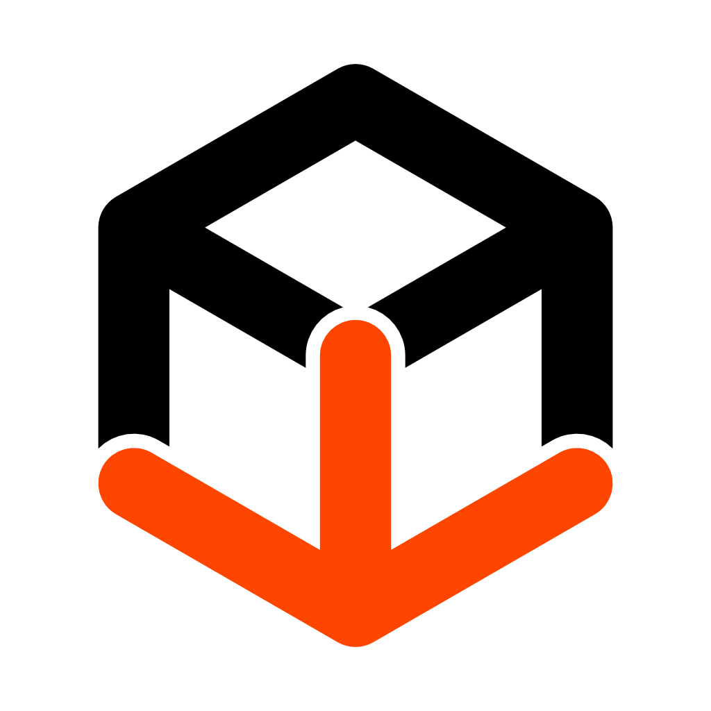

<h1> Lan Dock</h1>

> **The digital loading bay for your LAN.**

**Lan Dock** is a cross-platform, local file-sharing tool designed to make transferring files between your computer and mobile devices instant and seamless. No internet required—just your local network. Share, download, and manage files across devices instantly. No cloud, no limits, just local speed.


---

## 🚀 Features

* **⚡ Zero-Install Client:** Client doesn't need an app. Just scan the QR code or type URL to open the transfer interface in your browser.
* **🔒 Private by Design:** Transfers happen purely over your Local Area Network (LAN). Your data never leaves your room.
* **🖥️ Cross-Platform Native App:** Runs natively on **macOS**, **Windows**, and **Linux** with a clean, responsive interface.
* **🚀 Faster speed:** Uses your full local network bandwidth (Wi-Fi/Ethernet) for transfers. No internet speed caps.
* **🎨 Modern UI:** Responsive modern clean minimal UI.
* **📦 Single Binary:** One lightweight executable contains everything - frontend, assets, and server.

---

## 📥 Downloads

Go to the [**Releases Page**](https://github.com/manov-ik/lan-dock/releases) to download the latest version for your OS.

| Platform | File |
| :--- | :--- |
| **macOS** | `landock_mac_v1.0.0.zip` |
| **Windows** | `landock_windows_64_v1.0.0.zip` |
| **Linux** | `landock_linux_v1.0.0.zip` |

---

## 🛠️ How it Works

1.  **Run Lan Dock** on your computer and select folder to share.
2.  **Scan the QR Code** on client (or type the URL).
3.  **Upload/Download/Delete** files instantly between devices.

---

## 🧑‍💻 Development

### Prerequisites
* [Go 1.21+](https://go.dev/dl/)
* **Fyne Toolkit:** `go install fyne.io/fyne/v2/cmd/fyne@latest`

### Running Locally
1.  Clone the repo:
    ```bash
    git clone [https://github.com/manov-ik/landock.git](https://github.com/manov-ik/landock.git)
    cd landock
    ```
2.  Install dependencies:
    ```bash
    go mod tidy
    ```
3.  Run the app:
    ```bash
    go run .
    ```

---

## 🏗️ Building from Source

To build standalone executables, we use the `fyne` command line tool and `fyne-cross` (Docker).

### 🍎 macOS (Native Build)
Run this on a Mac to build the `.app` file:
```bash
~/go/bin/fyne package -os darwin -icon icon.png -app-id com.landock.app

```

### 🪟 Windows (via Docker)

Builds a 64-bit `.exe`:

```bash
~/go/bin/fyne-cross windows -arch=amd64 -icon icon.png -app-id com.landock.app -ldflags '-s -w'

```

### 🐧 Linux (via Docker)

Builds a standard Linux binary:

```bash
~/go/bin/fyne-cross linux -arch=amd64 -icon icon.png -app-id com.landock.app -ldflags '-s -w'

```

---

## 📂 Project Structure

* `main.go`: The core application logic (Fyne GUI + Gin Server).
* `frontend/`: Contains the web interface (`index.html`, `style.css`, `script.js`).

---

## 🤝 Contributing

Contributions are welcome! Feel free to open an issue or submit a pull request.

1. Fork the Project
2. Create your Feature Branch (`git checkout -b feature/AmazingFeature`)
3. Commit your Changes (`git commit -m 'Add some AmazingFeature'`)
4. Push to the Branch (`git push origin feature/AmazingFeature`)
5. Open a Pull Request

---

## 📄 License

Distributed under the GNU General Public License, Version 3. See `LICENSE` for more information.

---

## ❤️ Credits

* Built with [Go](https://go.dev/) & [Fyne](https://fyne.io/).
* Web Server powered by [Gin](https://github.com/gin-gonic/gin).
* QR Codes by [skip2/go-qrcode](https://github.com/skip2/go-qrcode).
* Fonts by [Google Fonts](https://fonts.google.com/)
